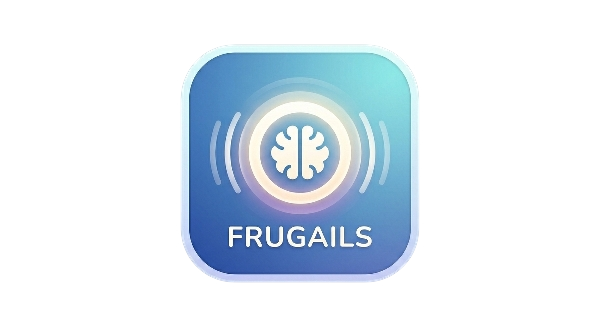
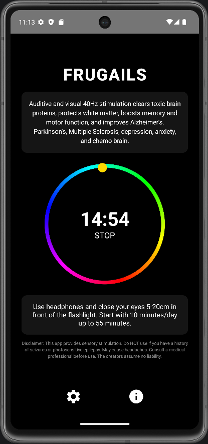
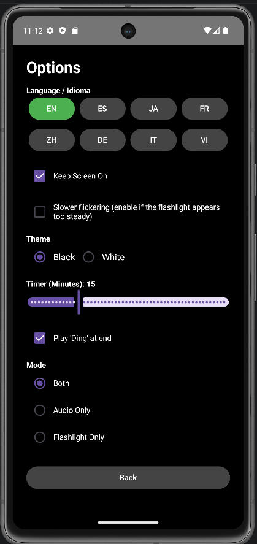
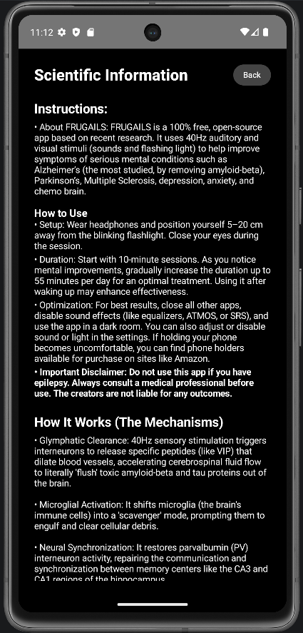

# FRUGAILS: Auditive and Visual 40Hz Sensory Stimulation

  

**FRUGAILS** is a 100% free, open-source Android application dedicated to global mental health. Based on groundbreaking MIT research (Tsai Laboratory), it delivers precise 40Hz auditory and visual stimuli designed to clear toxic brain proteins and protect neural white matter.

---

## 📸 App Showcase

  
  
  

---

## 🚀 Download & Installation

Get the latest version directly from our GitHub Releases:

[**📥 Download FRUGAILS.apk (v1.1)**](https://github.com/PacifAIst/FRUGAILS/releases/download/v1.1/FRUGAILS.apk)

*Note: You may need to enable "Install from Unknown Sources" in your Android settings to install this file.*

---

## 🧠 Scientific Basis (The Mechanisms)

Sensory stimulation at 40Hz (Gamma frequency) triggers biological responses recently proven in clinical studies:

* **Glymphatic Clearance:** Triggers interneurons to release peptides (like VIP) that dilate blood vessels, accelerating cerebrospinal fluid flow to "flush" toxic amyloid-beta and tau proteins.
* **Microglial Activation:** Shifts the brain's immune cells into a "scavenger" mode to engulf and clear cellular debris.
* **Neural Synchronization:** Restores parvalbumin (PV) interneuron activity, repairing communication between hippocampal memory centers.
* **White Matter Protection:** Prevents the death of oligodendrocytes, preserving the protective white matter insulation around neural axons.

### Conditions Targeted
**Alzheimer’s Disease** (Amyloid-beta removal) | **Parkinson’s Disease** (Alpha-synuclein reduction) | **Multiple Sclerosis** (Myelin preservation) | **Depression & Anxiety** | **Chemo Brain**

---

## 📲 How to Use

For an optimal treatment session:

1. **Setup:** Wear high-quality headphones. Position the phone **5–20 cm** away from the blinking flashlight.
2. **Session:** Close your eyes during the session.
3. **Duration:** Start with **10-minute sessions**. Gradually increase to **55 minutes/day** as you notice mental improvements.
4. **Optimization:** Use in a dark room. Disable sound effects (ATMOS, SRS, Equalizers) and close other background apps.
5. **Timing:** Use shortly after waking up to enhance effectiveness.

---

## 🛠 Features

* **Urgent Thread Priority:** Microsecond-precise 40Hz flickering via native hardware-level background service.
* **Golden UI Design:** Minimalist interface featuring a golden tracking dot and an animated rainbow rim.
* **Multilingual:** Supports English, Español, 日本語, Français, 中文, Deutsch, Italiano, and Tiếng Việt.
* **Safety Control:** Includes a "Slower Flickering" mode for older devices and photosensitivity comfort.

---

## 🧪 Recent Research Findings (2023–2026)

* [**PNAS, Jan 2026**](https://www.pnas.org/doi/10.1073/pnas.2529565123): Primates showed >200% increase in amyloid-beta clearance.
* [**Oxford Sleep, Mar 2025**](https://academic.oup.com/sleep/article/48/3/zsae299/7928860): Evoked gamma activity during sleep without degrading quality.
* [**bioRxiv, Mar 2025**](https://www.biorxiv.org/content/10.1101/2025.03.14.643227v1.full-text): Synchronized 40Hz stimulation enhanced working memory speed.
* [**PNAS, Oct 2024**](https://www.pnas.org/doi/10.1073/pnas.2419364122): Audio-visual flicker improved spatial navigation in hippocampal regions.
* [**MIT/Picower, Aug 2024**](https://picower.mit.edu/news/study-reveals-ways-which-40hz-sensory-stimulation-may-preserve-brains-white-matter): Protected myelin-producing cells from ferroptosis.
* [**Nature/EurekAlert, Feb 2024**](https://www.eurekalert.org/news-releases/1035324): Proved VIP peptide mechanism for brain waste drainage.
* [**Liu et al., 2023**](https://www.withpower.com/trial/phase-parkinson-disease-1-2022-eb496): Chronic stimulation improved motor symptoms in Parkinson's models.

---

## ⚠️ Important Disclaimer

**Do NOT use this app if you have a history of seizures or photosensitive epilepsy.** Sensory stimulation can trigger adverse events. May cause headaches. Always consult a medical professional before use. The creators assume no liability for any outcomes.

---

## 📩 Contact

**Author:** Dr. Manuel Herrador  
**Email:** [mherrador@ujaen.es](mailto:mherrador@ujaen.es)  
**Project GitHub:** [PacifAIst/FRUGAILS](https://github.com/PacifAIst/FRUGAILS)
